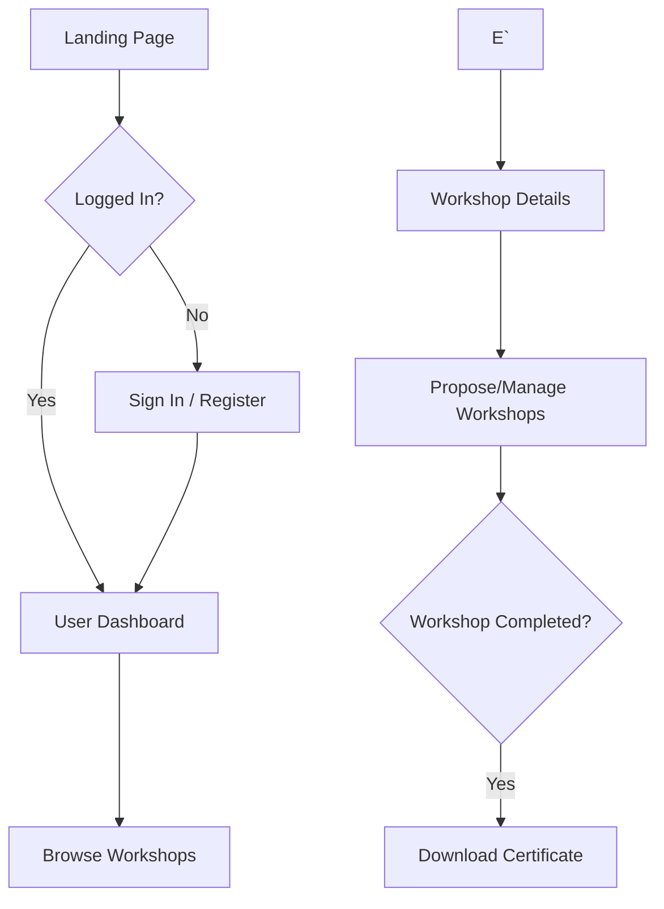

# FOSSEE Workshop Booking UI Update

Hey everyone! I've updated the frontend for the [FOSSEE Workshop Booking](https://github.com/FOSSEE/workshop_booking) platform. 

The Django backend is completely untouched (models, views, etc. are exactly the same). I basically just refreshed the templates and CSS to make it look a lot more modern and work better on mobile devices.

## What's new

- Overhauled the look and feel using normal CSS (just using CSS variables for a simple design system).
- Changed the fonts to use Sora for headings and Inter for text.
- Removed the old raw Bootstrap tables everywhere and replaced them with nicer cards and detail panels.
- Formatted the forms so they have clear labels and look decent on small screens.
- Added a quick live search on the Workshop Types page using a tiny bit of React.
- Fixed mobile scrolling issues. Nav and tables are much better now.

## How to run it locally

Just make sure you have Python 3.8+ installed.

```bash
# clone and cd into the repo
cd workshop_booking-enhanced

# setup a virtual env
python -m venv venv
# windows
venv\Scripts\activate
# mac/linux
# source venv/bin/activate

cd workshop_booking-enhanced

# install stuff
pip install -r requirements.txt
pip install setuptools

# setup db and run
python manage.py makemigrations
python manage.py migrate
python manage.py runserver
```

Then just load up ` and we're good to go.
http://127.0.0.1:8000/
## Mobile Access & Verification

This project is fully responsive and has been verified to work on mobile devices. You can access the platform on your local network using the following details:

- **Verification Status**:   Working on Mobile
- **Network Access ID (Local IP)**: `10.126.55.97:8000`
- **Configuration**: The server is configured to listen on all interfaces (`0.0.0.0:8000`) with `ALLOWED_HOSTS = ['*']` enabled for development testing.


## Project Architecture & Flow

This diagram illustrates the core user journey through the enhanced FOSSEE Workshop Booking platform:



## File changes
Mainly just touched things in `workshop_app/templates/` and `workshop_app/static/`. No python backend files were modified.

## Screenshots

### Before Redesign
The original interface used the default Django admin styling for authentication and basic Bootstrap tables for data display, which felt generic and unoptimized for modern workflows.


### After Redesign
The interface has been modernized with a professional split-screen entry, dark mode support, a multi-step registration flow, and an institutional-grade dashboard.

#### New Login Experience


#### Enhanced Workshop Discovery


